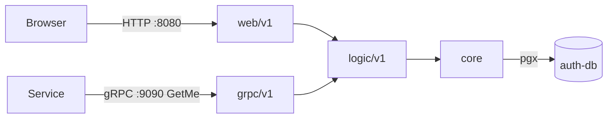

# auth-service — agent guide

Tight, imperative reference for AI agents. Read this before touching the repo.

## Contribution workflow

**Commits**

- **No attribution trailers.** Never add `Signed-off-by`, `Co-authored-by`, `Assisted-by`, `Generated-by`, or any AI/tool attribution.
- **Subject** ≤ 50 chars, capitalised, imperative, no trailing period (`Add session revocation`, not `Added`/`Adds`).
- **Body** (only if non-trivial): explain *what* and *why*, wrap at 72 chars, one blank line after the subject.
- **No issue refs** in the message (no `Fixes #123`). Put links in the PR description.
- **No @-mentions** of users or teams.

**Branch + PR**

- **Never push to `main`.** Branch first: `feat|fix|chore|docs|refactor|ci/<desc>`.
- Open a PR against `main`. **Squash-merge.**
- Every changed line must trace to the task. Don't refactor or reformat adjacent code.

## Code quality

- Write **idiomatic Go**. Follow existing patterns; match the surrounding style.
- **Wrap errors** with context: `fmt.Errorf("query user %q: %w", name, err)`. Never swallow errors — check or explicit `_ =`.
- **Structured logging** via Zerolog (shared `pkg/logger/zerolog`). No `fmt.Println`.
- **Test** new behaviour. Table-driven tests; keep `go test ./...` green.
- **No secrets** in code, logs, or fixtures. Gitleaks runs in CI.
- Pass `golangci-lint` (v2, `.golangci.yml`) — zero tolerance, CI's `go-check` blocks merge.

## Project overview

`auth-service` — authentication microservice. Module `github.com/duynhlab/auth-service`.

Issues and validates **opaque, cryptographically-random session tokens** (not JWT, 24h expiry). Handles login, registration, logout, and current-user lookup. Exposes an HTTP API (browser + in-cluster) and a gRPC `AuthService/GetMe` server — the latter is the east-west authority every other service calls to validate bearer tokens.

## Repository layout

```
auth-service/
├── cmd/                     # Entry point: dual-port (HTTP + gRPC), graceful shutdown
├── config/                  # Env-based configuration + validation
├── db/migrations/           # golang-migrate SQL migrations (sql/000001_*.up.sql), embedded in the binary via embed.go
├── internal/
│   ├── web/v1/              # HTTP handlers (Gin) — transport
│   ├── grpc/v1/             # gRPC AuthService server (GetMe) — transport
│   ├── logic/v1/            # Business rules + domain errors (NO SQL)
│   └── core/                # Domain models, repository interfaces, pgx implementations, DB pool
├── middleware/              # tracing, logging, prometheus, profiling, resource
└── Dockerfile
```

## Build, test, lint

```bash
GOTOOLCHAIN=auto go build ./... && go vet ./... && go test ./...   # unit
go test -tags=integration ./internal/core/repository/...           # integration (needs Docker)
golangci-lint run            # v2, .golangci.yml — MUST pass
```

### Testing conventions

- **Unit tests** — stdlib `testing` only (no testify/gomock), hand-written mocks for
  interfaces, table-driven subtests, in `*_test.go` next to the code: Web (`httptest`),
  Logic (pure — mock the repo), gRPC (call handlers directly), `middleware`, `config`. Run
  with `go test ./...` (no Docker).
- **Integration tests** — `internal/core/repository` is tested against a **real Postgres**
  via testcontainers, build-tagged `//go:build integration` (the default `go build`/`go test`
  skip them, so the binary never links testcontainers). Run locally with Docker:
  `go test -tags=integration ./internal/core/repository/...`. CI wires `integration: true`
  (go-check) + `integration-coverage: true` (sonar), and merges both coverage profiles into
  the ≥ 80% new-code gate.
- **Before pushing**, both the unit run *and* the integration suite must be green locally —
  green unit ≠ green CI (CI also runs integration with Docker).

Common lint fixes:

- `perfsprint` — use `errors.New()` over `fmt.Errorf()` when there are no format verbs.
- `nosprintfhostport` — use `net.JoinHostPort()` over `fmt.Sprintf("%s:%s", host, port)`.
- `errcheck` — check every error return (or explicit `_ = fn()`).
- `goconst` / `gocognit` — extract repeated literals / split complex funcs.
- `noctx` — use `http.NewRequestWithContext()`.

## Conventions

### 3-layer architecture (strict)

Dependency direction is **one-way**: `web → logic → core`. Never reverse.

| Layer | Location | Allowed | Forbidden |
|-------|----------|---------|-----------|
| **Web** | `internal/web/v1/` | HTTP handling, JSON binding, DTO mapping, call Logic, aggregation | SQL, direct DB access, business rules |
| **gRPC** | `internal/grpc/v1/` | gRPC transport, call Logic, map domain errors → gRPC codes | SQL, direct DB access, business rules |
| **Logic** | `internal/logic/v1/` | Business rules, call repository interfaces, domain errors | SQL, `database.GetPool()`, `*gin.Context`, HTTP |
| **Core** | `internal/core/` | Domain models, repository implementations, SQL, DB pool | HTTP, business orchestration |

- Web **and** gRPC are sibling transports at the same level; both delegate to the **same** Logic layer and return identical data.
- Use repository interfaces (defined in `core/domain/`) for data access. Constructor-injected dependencies only.
- **Never** call Logic functions across services — use the gRPC/HTTP transport. **Never** skip Logic (Web/gRPC must not touch `core/repository` directly).

### gRPC server (east-west transport)

- auth-service runs a gRPC **server** exposing `auth.v1.AuthService/GetMe` on `:9090` (`GRPC_PORT`), **alongside** HTTP `:8080`.
- gRPC is the **official east-west transport** — **always on**, no `GRPC_ENABLED` flag, no REST fallback. Only the port is configurable; `startGRPC` returns `nil` only if it cannot bind.
- Bootstrapped via shared `github.com/duynhlab/pkg/grpcx` (`grpcx.NewServer` wires the OTel stats handler, health, reflection).
- `GetMe` reads the bearer token from gRPC metadata and mirrors `GET /auth/v1/private/me`. Missing/malformed/invalid/expired → `codes.Unauthenticated` (**fail closed**); other errors → `codes.Internal`.

### Observability

Backed by shared `github.com/duynhlab/pkg/obsx`.

- `obsx.SetupMetrics()` runs in `main` **before** the gRPC bootstrap so otelgrpc handlers pick up the global MeterProvider. It bridges gRPC RED metrics (`rpc_server_*` / `rpc_client_*`) onto the **same** Prometheus registry and the **same** `/metrics` endpoint — **no separate metrics port**. Toggle via `METRICS_ENABLED`.
- HTTP RED metrics come from `middleware/prometheus.go` (`request_duration_seconds`, `requests_in_flight`, `request_size_bytes`, `response_size_bytes`, with trace exemplars).
- `obsx.TraceIDFromContext` gives the logging middleware its `trace_id` for log↔trace correlation (falls back to inbound `traceparent`/`X-Trace-ID`, then a generated ID).
- **Middleware chain order**: `tracing → logging → metrics` (registered in `setupServer`).
- Tracing: OTLP HTTP (`OTEL_COLLECTOR_ENDPOINT`, `OTEL_SAMPLE_RATE`, `TRACING_ENABLED`). Profiling: Pyroscope (`PYROSCOPE_ENDPOINT`, `PROFILING_ENABLED`).

### Diagrams

All diagrams **must** use Mermaid. Never ASCII art.



## Gotchas

- The gRPC server impl (`internal/grpc/v1`) is a **transport peer**, not a data layer — it calls Logic and maps errors to gRPC codes. **No DB access in the handler.**
- **Graceful-shutdown order is fixed** (VictoriaMetrics pattern): `/ready` → 503 → drain delay (`READINESS_DRAIN_DELAY`, default 5s) → HTTP `Shutdown` → gRPC `GracefulStop` → DB pool `Close` → tracer `Shutdown`. Don't reorder.
- **Kyverno image rules**: deploy images must be `ghcr.io/duynhlab/auth-service/auth:<sha>` (or `:vX.Y.Z`). **Never `:latest`.**
- Migrations run via the `migrate` subcommand (golang-migrate, embedded in the app binary; the init container reuses the app image), applying forward-only `.up.sql` files.
- DB has a **dual connection pattern**: main container via PgBouncer (`auth-db-pooler:5432`), init/migration container direct (`auth-db:5432`) for DDL.

## API reference

Routes mount directly at `/{service}/v1/{audience}/…` (Variant A — one URL shape for browser and in-cluster callers). Kong is pure pass-through.

| Method | Path | Audience | Description |
|--------|------|----------|-------------|
| `POST` | `/auth/v1/public/login` | public | Login, returns an opaque session token |
| `POST` | `/auth/v1/public/register` | public | Register, returns a session token |
| `GET` | `/auth/v1/private/me` | private | Current user from `Authorization: Bearer <token>` |
| `POST` | `/auth/v1/private/logout` | private | Revoke the caller's session token (idempotent) |

**gRPC** (east-west, not on the gateway): `auth.v1.AuthService/GetMe` on `:9090` — token in gRPC metadata, called by every service's auth middleware. Mirrors `GET /auth/v1/private/me`.

Full convention + inventory: [`homelab/docs/api/api-naming-convention.md`](https://github.com/duynhlab/homelab/blob/main/docs/api/api-naming-convention.md).
